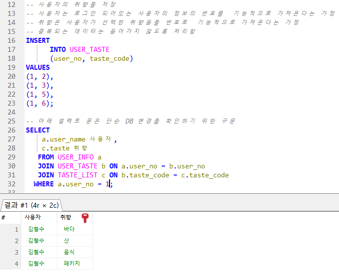

# 프로젝트 개요

## 🚨 **커밋크루(Commit Crew)**

Github 마스터가 되기 위한 Crew 모임

### 👩🏻‍💻 **구성원**

박지훈

박희찬

오민성

한동주 

최두혁

윤지영 


## 1. 프로젝트 주제

**[함께 만들어가는 여행 이야기]**

여행 계획, 동행 구하기, 후기 공유를 통해 패키지 여행의 장점과 자유 여행의 장점을 합쳐 만든 여행 소셜 플랫폼 

## 2. 프로젝트 소개

> 🚀 여행 일정을 계획 할 때 어느 관광 명소를 갈지, 어느 리조트에서 잘 지 고민이 많으시죠? 
본인의 취향을 선택해보세요! 같은 취향을 가진 동료들의 여행 후기를 추천해드립니다! 
마음에 들었다면 같은 여행 코스로 여행을 계획하거나, 게시글 작성자의 다른 여행 계획에 참여해보세요!

**TRIP_CREW**는 여행 동행 기능과 여행 후기 기능을 결합하여 사용자들의 여행 계획을 구체화하고, 새로운 경험을 공유하며, 소통을 넓힐 수 있는 좋은 기회를 제공합니다.

사용자는 본인의 여행 취향을 선택해두면 취향에 맞는 여행 후기 게시글을 추천 받을 수 있으며 여러 여행 후기를 참고하여 본인의 여행 코스를 계획할 수 있습니다.

사용자는 본인이 계획한 여행 코스를  등록하고 함께할 여행 동행 CREW를 모집할 수도 있습니다. 

여행을 즐기는 사람들에게 소중한 동행을 찾을 수 있는 기회를 제공하고, 다양한 여행 후기를 통해 다른 사용자들에게 유익한 정보를 제공하여 여행 경험을 더욱 풍부하게 해 줄 것입니다.

## 3. 프로젝트 배경 및 필요성

### 3-1. 코로나 이후 회복되는 여행 시장


출처. 한국관광데이터랩
(*국민 해외관광객 : 전체 국민 출국자 중 세계관광기구(UNWTO) 거주지 분류 권고안에 근거하여 재외국민 출국자(교포)는 제외)

- **코로나 이후 회복되는 여행 시장**
    
    코로나19로 인해 억눌렸던 여행 욕구가 폭발하며, 2023년부터 글로벌 여행 시장이 빠르게 회복세를 보이고 있습니다. 특히, 개인의 경험을 중시하고 다양한 문화를 체험하려는 젊은 세대를 중심으로 해외 여행에 대한 관심이 높아지면서 여행 인구가 급증하고 있습니다. 이러한 시장 변화에 발맞춰 저희는 TRIP_CREW를 개발하게 되었습니다.
    
     급성장하는 여행 시장의 니즈를 충족시키고, 여행객들에게 더욱 풍성한 경험을 제공하기 위해 탄생했습니다. 특히, 혼자 여행을 떠나고 싶지만 안전이나 외로움에 대한 부담을 느끼는 사람들을 위해 동행을 쉽게 찾을 수 있는 소셜 플랫폼을 구축하고자 하였습니다.

### 3-2. 자유여행 선호


- **유엔 세계 관광 기구(UNWTO)**: 세계 관광 동향을 분석하는 UNWTO의 보고서에 따르면, 젊은 세대(밀레니얼 세대 및 Z세대)를 중심으로 패키지 여행 보다는 자유 여행 떠나는 여행자 수가 지속적으로 증가하고 있습니다.

- **글로벌 웹 인덱스(Global Web Index)**: 이 조사에서는 여행자들이 점점 더 개인 맞춤형 경험을 선호하고, 전통적인 패키지 여행 대신 개인 여행 계획을 선호하는 것으로 나타났습니다.
- 기술 발전과 다양한 플랫폼의 등장으로 개인 맞춤형 여행 및 자유여행이 활성화되고 있습니다.
    - 스마트폰의 대중화와 함께 언제 어디서든 인터넷에 접속할 수 있는 환경이 조성되면서 여행 중에도 실시간으로 정보를 얻을 수 있게 되었고, 구글 맵·트립어드바이저 등의 모바일 앱 활성화로 여행객들은 더욱 편리하고 손쉽게 여행 계획을 세울 수 있게 되었습니다.
    - 에어비앤비, 부킹닷컴 등의 숙소 예약 플랫폼과 우버, 그랩 등 교통 플랫폼이 생기면서 편의성이 크게 향상되었고 자유 여행의 장벽이 낮아지고 있습니다.

### 3-3. 불안감 해소

- 혼자 자유 여행을 계획하는 사람이라면 누구나 한 번쯤 안전과 낯선 환경으로 인해 떠나기를 망설이게 됩니다. 안전 뿐만 아니라 언어 소통의 어려움, 긴급 상황 발생 시 대처 문제 등을 우려하게 되고 특히, 치안이 불안하거나 문화가 생소한 나라를 여행할 때는 더욱 큰 걱정이 앞서게 됩니다.
- 지금까지 그런 이유로 너무 떠나고 싶었던 나라 포기하셨던 사용자에게 동행 모집을 통해 함께 안전하게 떠날 수 있는 환경을 제공할 수 있습니다. 동행을 구해 함께 여행하면 위험 상황 발생 시 서로 도울 수 있고, 정보 공유를 통해 안전한 여행을 즐길 수 있습니다.
- 동행을 구함으로써 불안감을 해소하고 함께 만들어나가는 여행을 계획할 수 있습니다.

### 3-4. 비용 절감

동행을 모집하면 숙소, 렌터카, 투어 등 다양한 여행 비용을 절감할 수 있습니다.

- 혼자 자유여행을 떠날 때 숙소비 분담 : 호텔이나 리조트 등 숙소를 혼자 이용하는 것보다 동행과 함께 객실을 공유하면 숙박비를 절반 이상 줄일 수 있습니다. 혼자 여행할 때는 1인실 위주로 숙소를 찾아야 하지만, 동행과 함께라면 더블룸이나 도미토리 등 다양한 옵션을 선택할 수 있어 예산에 맞춰 숙소를 선택할 수 있습니다.
- 렌터카 및 교통비 분담 : 여러 명이 함께 렌터카를 이용하면 렌터카 비용을 나눠 부담할 수 있고, 대중교통 이용에 비해 더욱 자유롭게 여행을 즐길 수 있습니다. 대중교통을 이용하는 경우에도, 동행과 함께 티켓을 구매하거나 패스를 공유하면 교통비를 절약할 수 있습니다. 특히, 해외 여행의 경우 교통비가 전체 여행 예산에서 차지하는 비중이 크기 때문에, 동행과 함께 교통비를 분담하는 것은 매우 효과적인 방법입니다.
- 투어 비용 분담 : 혼자 참여하는 개인 투어보다 그룹 투어에 참여하면 투어 비용을 할인받을 수 있고, 동행과 함께라면 더욱 즐거운 시간을 보낼 수 있습니다.

## 4. 프로젝트 주요 기능

### 4-1. 여행 후기 등록 및 조회 기능

- 사용자가 실제로 다녀온 여행에 대한 후기를 여행 후기 게시판에 등록, 수정, 삭제  할 수 있습니다.
- 여행 후기에 별점을 등록하여 다른 여행자의 여행이 나와 잘 맞는지 알아볼 수 있습니다.
- 여행 후기에 댓글을 등록하여 다른 여행자와 소통할 수 있습니다.

### 4-2. 여행 코스 등록 및 조회 기능

- 여행 코스 계획을 만들어 등록할 수 있습니다.
- 코스의 나라와 도시 명을 지정, 분류하여 검색할 수 있도록 합니다.
- 취향을 선택하면 같은 취향의 여행자에게 추천합니다.

### 4-3. 여행 동행 모집 기능

- 등록한 여행 코스를 바탕으로 같이 여행을 떠날 여행자를 구할 수 있습니다.
- 내가 만든 코스의 동행을 구하는 글을 올리면 비슷한 취향을 가진 여행자들이 동행을 요청하고, 요청자를 확인하여 수락, 반려할 수 있습니다. 만약 수락 이후에 문제를 일으킨다면 강퇴가 가능합니다.
- 여행 코스를 등록하지 않아도 작성한 취향을 바탕으로 비슷한 취향의 여행 코스를 추천해드립니다. 취향이 맞는 사람에게 동행을 요청할 수 있습니다.

### 4-4. 회원가입

- 기본적인 회원 가입 기능

### 4-5. 알림 기능

- 사용자에게 알림이 필요한 경우 웹페이지나 메일로 알림을 발송합니다.

### 4-6. 신고 기능

- 비정상적인 행위를 하는 이용자를 신고할 수 있습니다.
- 신고 시 관리자가 확인할 수 있는 신고 목록 페이지에 신고 사항이 등록되고, 관리자 판단 하에 신고를 승인하거나 반려할 수 있습니다.
- 신고 승인 시 피신고자의 계정은 정해진 기간 동안 정지될 수 있습니다.

### 4-7. 여행 취향 등록 기능

- 다양한 취향 중에서 자신이 어떤 취향을 가지고 있는지 선택할 수 있습니다.
- 이 취향을 바탕으로 비슷한 취향을 가진 여행자나 그 여행자가 등록한 여행 코스를 추천받을 수 있습니다.

## 5. 서비스 차별화 전략

## 6. 요구사항 명세서 작성
<details>
<summary>요구사항 명세서</summary>
<div markdown="1">


</div>
</details>

## 7. UML, 플로우차트
<details>
<summary>UML</summary>
<div markdown="1">


</div>
</details>
<details>
<summary>플로우차트</summary>
<div markdown="1">


</div>
</details>

## 8. 논리 ERD, 물리 ERD
<details>
<summary>논리 ERD</summary>
<div markdown="1">


</div>
</details>

<details>
<summary>물리 ERD</summary>
<div markdown="1">


</div>
</details>

## 9. 테이블 정의서(DDL 쿼리문 포함)
<details>
<summary>테이블 정의서</summary>
<div markdown="1">


</div>
</details>

## 10. 백업 계획

### 10-1 Replication

DB 서버의 부하 분산과 데이터 백업을 위해 Replication을 적용하였습니다.

<details>
<summary>네트워크 구성도</summary>
<div markdown="1">


</div>
</details>

실 서버에서 운영하다 보니 Replication이 충돌하는 일이 수시로 반복되었습니다.

문제는 해결하였으나 충돌하여 내려간 Slave의 상태를 확인하기 어려워 따로 로그를 수집하였습니다.
<details>
<summary>/etc/crontab</summary>
<div markdown="1">

```bash
...
* * * * *       root    logtime=`date "+\%Y-\%m-\%d \%H:\%M:\%S"` && logquery=`mariadb -e "SHOW SLAVE STATUS \G" | grep -E "[^_]Master_Log_File|Read_Master_Log_Pos|Running|Last_Error"` && printf "${logtime}\n${logquery}\n\n" >> /var/log/mariadb-replication-slave-status.log
...
```
</div>
</details>

<details>
<summary>Slave Logging</summary>
<div markdown="1">
tail -f /var/log/mariadb-replication-slave-status.log


</div>
</details>


### 10-2 mysqldump

Replication은 실시간 복제를 담당하므로 거기에 더해서 이력을 남기기 위해서 cron으로 mysqldump를 스케줄링하였습니다.

<details>
<summary>백업 스크립트</summary>
<div markdown="1">
trip_crew_backup.sh

```bash
...
backupDir="${1}/backup/${2}/"
dateTime=$(date +%Y%m%d%H%M%S)

mkdir -p ${backupDir}

mysqldump -u${3} -p${4} ${2} > "${backupDir}${2}_${dateTime}.sql"

find ${backupDir} -type f -name "*.sql" -mtime +7 -delete
...
```

crontab -e
```bash
# 민감한 정보는 중괄호로 처리했습니다.
...
0 * * * * {scriptDir}/trip_crew_backup.sh {backupDir} trip_crew {username} {password}
...
```
</div>
</details>

<details>
<summary>결과</summary>
<div markdown="1">


</div>
</details>


## 11. 테스트 결과서(테스트 쿼리문 포함)
<details>
<summary>취향</summary>
<div markdown="1">


<details>
<summary>사용자 취향 호출</summary>
<div markdown="1">


</div>
</details>


<details>
<summary>사용자 취향 저장</summary>
<div markdown="1">



</div>
</details>


<details>
<summary>사용자 취향 삭제</summary>
<div markdown="1">


</div>
</details>


<details>
<summary>사용자 취향 수정</summary>
<div markdown="1">


</div>
</details>


<details>
<summary>게시글 취향 호출</summary>
<div markdown="1">


</div>
</details>


<details>
<summary>게시글 취향 저장</summary>
<div markdown="1">


</div>
</details>


<details>
<summary>게시글 취향 삭제</summary>
<div markdown="1">


</div>
</details>


<details>
<summary>게시글 취향 수정</summary>
<div markdown="1">


</div>
</details>


<details>
<summary>여행 코스 취향 호출</summary>
<div markdown="1">


</div>
</details>


<details>
<summary>여행 코스 취향 저장</summary>
<div markdown="1">


</div>
</details>


<details>
<summary>여행 코스 취향 삭제</summary>
<div markdown="1">


</div>
</details>


<details>
<summary>여행 코스 취향 수정</summary>
<div markdown="1">


</div>
</details>


</div>
</details>